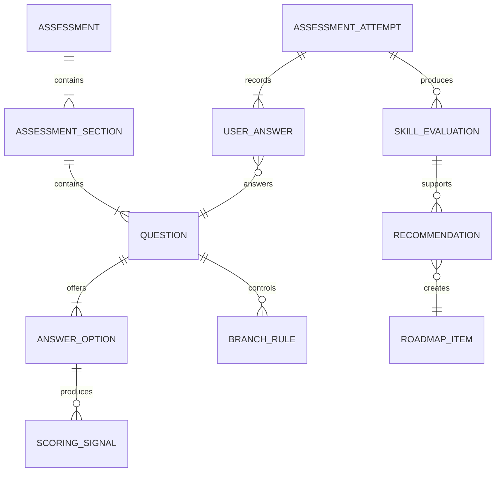

# MATIQ Assessment Model

## Purpose

The assessment collects athlete information, evaluates specific areas through
expert-defined rules, and produces input for the Roadmap. AI does not calculate
scores or select final recommendations.

## Pipeline

```text
Profile and goals
        ↓
General questions
        ↓
Discipline-specific questions
        ↓
Follow-up questions from an approved bank
        ↓
Expert rules
        ↓
Skill scores from 1 to 5
        ↓
Strong and weak areas
        ↓
Algorithmic recommendations
        ↓
AI explanation
```

## Assessment structure

An assessment consists of:

- a shared profile section;
- the user's general goals;
- a separate section for every selected discipline;
- branching questions;
- expert-defined scoring rules;
- a result containing scores and recommendations.

A user may select BJJ Gi, No-Gi Grappling, or both disciplines.

## Shared profile data

Preliminary data includes:

- years of experience;
- training frequency;
- belt, where applicable;
- competition experience;
- general goals;
- optional general physical limitations.

Shared data affects recommendation difficulty and priority but does not replace
evaluation of specific skills.

## General goals

A user may select and prioritise multiple goals:

- general development;
- competition preparation;
- returning after a break.

The assessment identifies specific position and skill goals. The user may add
them to the Roadmap manually.

## Questions

An `Admin` creates a question from approved expert methodology with:

- localised text;
- a discipline or general scope;
- answer type;
- available options;
- display conditions;
- related scoring rules;
- publication status.

Preliminary answer types are:

- single choice;
- multiple choice;
- numeric value;
- yes/no;
- ordering.

AI does not create questions or answer options.

## Branching

The next question is selected from the approved bank using configured
conditions. A condition may use:

- selected discipline;
- a previous answer;
- belt or general level;
- competition experience;
- selected goal;
- an area already identified as requiring clarification.

## Expert rules

An answer may produce one or more signals for specific evaluated areas.

Example:

```text
Question:
How confidently can you escape from bottom Side Control?

Answer:
It rarely works

Signal:
Discipline = No-Gi
Position = Side Control
Context = BOTTOM
SkillGroup = Escapes
Score contribution = 2
```

Follow-up question:

```text
Which Side Control escapes do you use?

I do not know any escapes
→ confirms a weak area

Elbow Escape
→ produces a signal for the specific technique

Bridge and Roll
→ produces a signal for the specific technique

Several variants
→ increases confidence in the broader evaluation
```

## Evaluated area

An evaluation may target a combination of:

```text
Discipline
+ GameArea
+ Position or SkillGroup
+ PositionContext
+ optional Technique or Movement
```

`TOP`, `BOTTOM`, and `STANDING` are evaluated independently.

## Scale

The internal score uses a 1–5 scale:

| Score | Meaning |
|---|---|
| 1 | Very weak area |
| 2 | Needs development |
| 3 | Intermediate level |
| 4 | Strong area |
| 5 | Very strong area |

The user sees German text categories. The numeric score may remain an internal
system detail.

## Aggregation

One evaluation may use several answers. An expert defines:

- target area;
- score value or adjustment;
- signal weight;
- application conditions;
- effect on result confidence.

The exact mathematical formula will be approved after preparing a real question
bank and test athlete profiles.

## Evaluation confidence

The system must distinguish between:

- a low skill score;
- insufficient data to evaluate the skill.

A preliminary result contains:

- final score from 1 to 5;
- confidence level;
- expert signals used;
- recommendation reasons.

Insufficient data may produce a follow-up question rather than an automatically
low score.

## Recommendation generation

The algorithm considers:

- strong and weak areas;
- evaluation confidence;
- general goals and their priority;
- discipline;
- general experience and belt;
- dependencies between positions, techniques, and Movements;
- available published videos, Drills, and Flows.

Recommendations must reference concrete expert-defined reasons.

## AI role

AI receives a structured result:

- a profile without unnecessary sensitive data;
- scores;
- reasons;
- selected recommendations;
- approved names and descriptions.

AI may:

- explain strong and weak areas;
- explain Roadmap ordering;
- make the text personal and understandable.

AI may not:

- create questions;
- change scores;
- create techniques or methodology;
- select recommendations outside the algorithm;
- provide medical advice.

## Editing and recalculation

- A user may edit answers.
- A change starts a new deterministic calculation.
- The current Roadmap is updated.
- The previous version is not displayed to the user.
- Input data, rule version, and result are retained for technical audit.

## Conceptual entities



Cardinalities will be refined during physical-schema design.

## Invariants

- `AM-001`: Only an `Admin` creates questions and answer options from approved
  expert methodology.
- `AM-002`: AI does not affect the numeric score.
- `AM-003`: Insufficient data is not treated as a weak skill.
- `AM-004`: Different disciplines have separate scores.
- `AM-005`: `TOP`, `BOTTOM`, and `STANDING` are evaluated independently.
- `AM-006`: Every result references an expert-rule version.
- `AM-007`: Every recommendation has a machine-readable reason.
- `AM-008`: Editing answers creates a new technical calculation result.
- `AM-009`: Medical diagnoses are not collected.
- `AM-010`: German is the first required assessment locale.

## Open questions

- The concrete signal-aggregation formula.
- The evaluation-confidence scale.
- Question types required by the real expert bank.
- Rules for resolving contradictory answers.
- Minimum evidence required for a recommendation.
- Technical assessment-history retention period.

## Document status

- Status: Approved conceptual baseline; scoring parameters pending expert bank
- Owner: MATIQ team
- Last reviewed: 2026-07-19
- Related code: Assessment and recommendation; implementation pending
