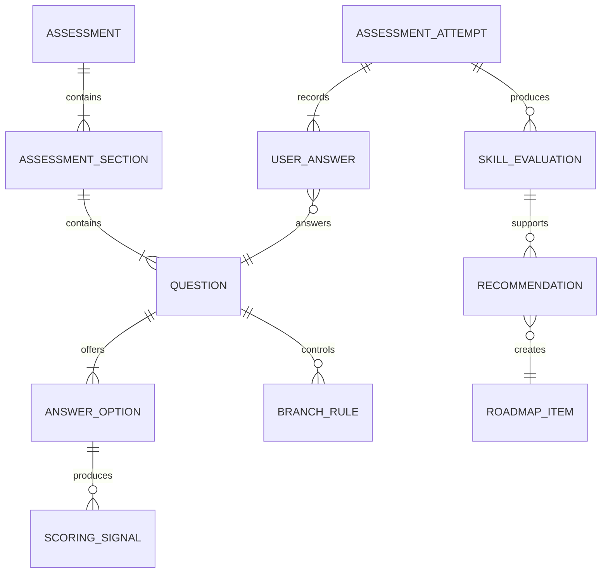

# Модель assessment MATIQ

## Назначение

Assessment собирает сведения о спортсмене, оценивает конкретные области по
экспертным правилам и формирует входные данные для Roadmap. AI не рассчитывает
оценки и не выбирает окончательные рекомендации.

## Конвейер

```text
Профиль и цели
        ↓
Общие вопросы
        ↓
Дисциплинарные вопросы
        ↓
Уточняющие вопросы из утверждённого банка
        ↓
Экспертные правила
        ↓
Оценки навыков 1–5
        ↓
Сильные и слабые области
        ↓
Алгоритмические рекомендации
        ↓
AI-объяснение
```

## Структура assessment

Assessment состоит из:

- общей части профиля;
- общих целей пользователя;
- отдельной секции для каждой выбранной дисциплины;
- ветвящихся вопросов;
- экспертных правил оценки;
- результата с оценками и рекомендациями.

Пользователь может выбрать BJJ Gi, No-Gi Grappling или обе дисциплины.

## Данные общего профиля

Предварительно собираются:

- количество лет опыта;
- частота тренировок;
- пояс, если применимо;
- соревновательный опыт;
- общие цели;
- добровольные общие физические ограничения.

Общие данные влияют на сложность и приоритет рекомендаций, но не заменяют
оценку конкретных навыков.

## Общие цели

Пользователь может выбрать несколько целей и расставить их по приоритету:

- общее развитие;
- подготовка к соревнованиям;
- возвращение после перерыва.

Конкретные цели по позициям и навыкам выявляются после assessment. Пользователь
может добавить их в Roadmap вручную.

## Вопросы

Вопрос создаётся `Admin` на основе утверждённой экспертной методологии и
содержит:

- локализованный текст;
- дисциплину или общую область применения;
- тип ответа;
- доступные варианты;
- условия показа;
- связанные правила оценки;
- статус публикации.

Предварительные типы ответа:

- один вариант;
- несколько вариантов;
- числовое значение;
- да/нет;
- упорядочивание.

AI не создаёт вопросы и варианты ответов.

## Ветвление

Следующий вопрос выбирается из утверждённого банка по заранее настроенным
условиям. Условие может учитывать:

- выбранную дисциплину;
- предыдущий ответ;
- пояс или общий уровень;
- наличие соревновательного опыта;
- выбранную цель;
- уже выявленную область, требующую уточнения.

## Экспертные правила

Ответ может давать один или несколько сигналов конкретным оцениваемым областям.

Пример:

```text
Вопрос:
Насколько уверенно вы выходите из Side Control снизу?

Ответ:
Получается редко

Сигнал:
Discipline = No-Gi
Position = Side Control
Context = BOTTOM
SkillGroup = Escapes
Score contribution = 2
```

Дополнительный вопрос:

```text
Какие выходы из Side Control вы применяете?

Не знаю выходов
→ подтверждает слабую область

Elbow Escape
→ даёт сигнал конкретной технике

Bridge and Roll
→ даёт сигнал конкретной технике

Несколько вариантов
→ увеличивает уверенность общей оценки
```

## Оцениваемая область

Оценка может относиться к комбинации:

```text
Discipline
+ GameArea
+ Position или SkillGroup
+ PositionContext
+ при необходимости Technique или Movement
```

`TOP`, `BOTTOM` и `STANDING` оцениваются независимо.

## Шкала

Внутренняя оценка хранится по шкале 1–5:

| Оценка | Смысл |
|---|---|
| 1 | Очень слабая область |
| 2 | Требует развития |
| 3 | Средний уровень |
| 4 | Сильная область |
| 5 | Очень сильная область |

Пользователь видит немецкие текстовые категории. Число может оставаться
внутренней деталью системы.

## Агрегация

Одна оценка может использовать несколько ответов. Эксперт задаёт:

- целевую область;
- значение или изменение оценки;
- вес сигнала;
- условия применения;
- влияние на уверенность результата.

Точная математическая формула утверждается после подготовки реального банка
вопросов и тестовых профилей.

## Уверенность оценки

Система должна отличать:

- низкую оценку навыка;
- недостаток данных для оценки.

Предварительно результат содержит:

- итоговую оценку 1–5;
- уровень уверенности;
- использованные экспертные сигналы;
- причины рекомендации.

Недостаток данных может приводить к дополнительному вопросу, а не автоматически
к низкой оценке.

## Формирование рекомендаций

Алгоритм учитывает:

- слабые и сильные области;
- уверенность оценки;
- общие цели и их приоритет;
- дисциплину;
- общий опыт и пояс;
- зависимости между позициями, техниками и Movement;
- доступные опубликованные видео, Drills и Flows.

Рекомендации должны ссылаться на конкретные экспертные причины.

## Роль AI

AI получает структурированный результат:

- профиль без лишних чувствительных данных;
- оценки;
- причины;
- выбранные рекомендации;
- утверждённые названия и описания.

AI может:

- объяснить сильные и слабые области;
- объяснить порядок Roadmap;
- сделать текст персональным и понятным.

AI не может:

- создавать вопросы;
- менять оценки;
- создавать техники или методологию;
- выбирать рекомендации вне алгоритма;
- давать медицинские рекомендации.

## Редактирование и пересчёт

- Пользователь может редактировать ответы.
- Изменение запускает новый детерминированный расчёт.
- Текущий Roadmap обновляется.
- Старая версия не показывается пользователю.
- Входные данные, версия правил и результат сохраняются для технического
  аудита.

## Концептуальные сущности



Кардинальности уточняются при проектировании физической схемы.

## Инварианты

- `AM-001`: Вопрос и варианты ответов создаются только `Admin` на основе
  утверждённой экспертной методологии.
- `AM-002`: AI не влияет на числовую оценку.
- `AM-003`: Недостаток данных не считается слабым навыком.
- `AM-004`: Оценки разных дисциплин хранятся отдельно.
- `AM-005`: `TOP`, `BOTTOM` и `STANDING` оцениваются независимо.
- `AM-006`: Каждый результат связан с версией экспертных правил.
- `AM-007`: Каждая рекомендация имеет машиночитаемую причину.
- `AM-008`: Редактирование ответов создаёт новый технический результат
  расчёта.
- `AM-009`: Медицинские диагнозы не собираются.
- `AM-010`: Первая обязательная локаль assessment — немецкая.

## Открытые вопросы

- Конкретная формула агрегации сигналов.
- Шкала уверенности оценки.
- Типы вопросов, необходимые реальному экспертному банку.
- Правила разрешения противоречащих ответов.
- Минимальное количество данных для рекомендации.
- Срок хранения технической истории assessment.

## Document status / Статус документа

- Статус: Утверждённая концептуальная основа; параметры ожидают expert bank
- Владелец: Команда MATIQ
- Последняя проверка: 2026-07-19
- Связанный код: Assessment и recommendation; реализация ожидается
