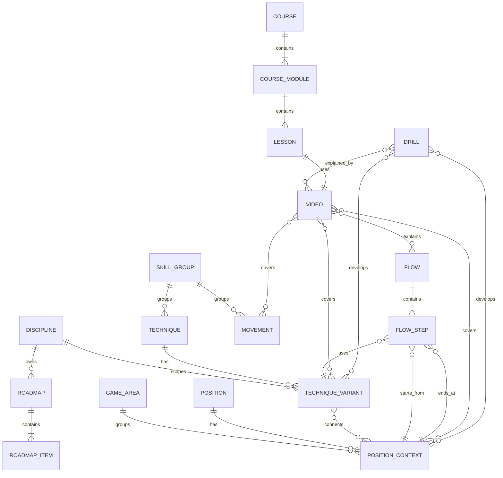

# MATIQ Domain Model

## Purpose

This document defines MATIQ's agreed terminology and conceptual relationships.
It is not a database schema or a Prisma Schema. The technical model will be
created only after the domain boundaries have been approved.

## Core glossary

| Term               | Meaning                                                                  |
| ------------------ | ------------------------------------------------------------------------ |
| `Discipline`       | A sport discipline such as BJJ Gi or No-Gi Grappling                     |
| `GameArea`         | A broad game area: `STANDING`, `TOP`, or `BOTTOM`                        |
| `Position`         | A sport position such as Side Control or Closed Guard                    |
| `PositionContext`  | Work from one side of a position, such as Side Control `TOP` or `BOTTOM` |
| `SkillGroup`       | A group of related skills such as Takedowns, Guard Passing, or Escapes   |
| `Technique`        | A sport action applied in a real situation                               |
| `TechniqueVariant` | A technique variant scoped by discipline, position, and other conditions |
| `Movement`         | A fundamental movement such as Shrimp, Bridge, or Technical Stand-up     |
| `Drill`            | A repeatable method for practising a position, technique, or movement    |
| `Flow`             | An expert-authored sequence of transitions and techniques                |
| `Roadmap`          | A personal development plan for a specific athlete                       |
| `Video`            | The primary playable media item                                          |
| `Course`           | An ordered educational programme                                         |
| `Module`           | A section of a course                                                    |
| `Lesson`           | A complete course topic with one primary video                           |

## Methodology hierarchy

```text
Discipline
└── GameArea
    ├── Position + PositionContext
    └── SkillGroup
        ├── Technique
        │   └── TechniqueVariant
        └── Movement
```

Example:

```text
No-Gi Grappling
└── TOP
    ├── Takedowns
    │   ├── Single Leg
    │   │   ├── Outside Single Leg
    │   │   └── Run the Pipe
    │   └── Double Leg
    ├── Guard Passing
    │   ├── Knee Cut Pass
    │   └── Body Lock Pass
    └── Side Control / TOP
        ├── Control
        ├── Transitions
        └── Submissions
```

The hierarchy supports navigation and methodology but does not prohibit
additional relationships between entities.

## Disciplines and technique variants

One `Technique` may be used in multiple disciplines. Execution differences are
stored in `TechniqueVariant`.

```text
Technique: Single Leg
├── Variant: BJJ Gi
└── Variant: No-Gi
```

A variant may define:

- discipline;
- starting and ending positions;
- `TOP`, `BOTTOM`, or `STANDING` context;
- allowed grips and constraints;
- related materials.

## Position and context

One position is considered from different sides:

```text
Side Control
├── TOP
│   ├── control
│   ├── position advancement
│   └── attacks
└── BOTTOM
    ├── defence
    └── escapes
```

Athlete evaluations for `TOP` and `BOTTOM` are independent. Strong top work
does not imply strong bottom work in the same position.

## Skill evaluation

An evaluation is scoped by:

```text
Discipline
+ GameArea
+ Position or SkillGroup
+ PositionContext
= SkillAssessment
```

The internal scale is 1–5. The user sees understandable categories, for example:

| Value | Category           |
| ----- | ------------------ |
| 1     | Very weak area     |
| 2     | Needs development  |
| 3     | Intermediate level |
| 4     | Strong area        |
| 5     | Very strong area   |

The exact German labels will be approved during interface design. Expert rules,
not free-form AI decisions, produce the value.

## Techniques and transitions

A technique may connect positions:

```text
Open Guard
    ↓ Knee Cut Pass
Side Control
```

A technique variant may have:

- one or more starting positions;
- one or more ending positions;
- intermediate states;
- a primary context;
- additional related positions.

## Flow

A `Flow` is an expert-authored sequence of actions:

```text
Standing
    ↓ Takedown
Top Open Guard
    ↓ Guard Pass
Side Control
    ↓ Transition
Mount
```

A Flow contains:

- a name;
- a discipline;
- a goal;
- ordered steps;
- a step starting position;
- a technique or variant;
- a step ending position.

A video may explain an entire Flow or one step.

## Roadmap

A `Roadmap` is an athlete's personal development plan. It differs from a Flow:

- a Flow describes an expert-authored sequence of actions;
- a Roadmap describes what a specific user should develop;
- a Roadmap may include positions, skill groups, techniques, variants, drills,
  Flows, lessons, and standalone videos.

A separate Roadmap is created for every selected discipline. A user may:

- add existing recommendations;
- hide items;
- change order;
- change priority.

A user cannot create new system positions, techniques, or variants.

## Video

One video is a complete item in which explanation and demonstration are not
separated.

A video has:

- one primary topic of type `GameArea`, `Position`, `SkillGroup`, `Technique`,
  `Movement`, or `Drill`;
- a primary discipline;
- related positions and contexts;
- related skill groups;
- related techniques and variants;
- related drills;
- related Flows;
- secondary topics.

A video may demonstrate a long sequence, while its primary topic determines the
recommendation for which it is the best initial match.

For example, a video with `Takedowns` as its primary topic may additionally
cover Single Leg, Double Leg, and Body Lock Takedown.

## Movement

A `Movement` describes a fundamental movement that is useful by itself and may
support many techniques. It is especially important for beginner content and
recommendations.

Examples:

- Shrimp;
- Bridge;
- Technical Stand-up.

A Movement may be related to a discipline, positions, techniques, drills, and
videos.

## Courses

```text
Course
└── Module
    └── Lesson
        └── Main Video
```

- A course contains ordered modules.
- A module contains ordered lessons.
- A lesson covers one complete topic.
- A lesson contains one primary video.
- Additional related videos are displayed separately.
- A video may exist outside a course and be added directly to a Roadmap.

## Drill

A `Drill` is a separate entity and a method for developing a position,
technique, or movement. It is not a mandatory assignment.

A Drill may contain:

- execution type `SOLO` or `PARTNER`;
- practice goal;
- recommended duration;
- recommended repetition count;
- required equipment;
- related positions and contexts;
- related techniques and variants;
- one or more explanatory videos.

Preliminary practice goals are:

- muscle memory;
- speed;
- coordination;
- reaction;
- movement quality;
- position retention or recovery.

## Conceptual relationships



The diagram is conceptual. Cardinalities will be refined during physical-schema
design.

## Preliminary invariants

- `DM-001`: A `PositionContext` always belongs to one `Position`.
- `DM-002`: `TOP` and `BOTTOM` evaluations are stored independently.
- `DM-003`: A `TechniqueVariant` always belongs to one primary `Technique`.
- `DM-004`: Every `FlowStep` has a defined order within its Flow.
- `DM-005`: A video has exactly one primary topic.
- `DM-006`: A lesson has exactly one primary video.
- `DM-007`: A video may exist outside a course.
- `DM-008`: A Drill is not a mandatory user assignment.
- `DM-009`: A Roadmap belongs to one user and one discipline.
- `DM-010`: A user cannot create system methodology entities.
- `DM-011`: A Flow belongs to exactly one discipline.
- `DM-012`: A user does not see old Roadmaps, but recalculations are retained
  for technical audit.
- `DM-013`: Methodology data supports localisation; the first required locale
  is German.
- `DM-014`: A video's primary topic can only be a `GameArea`, `Position`,
  `SkillGroup`, `Technique`, `Movement`, or `Drill`.

## Implemented content and roadmap integration

The first physical content slice is implemented in Prisma and the API:

- `Course` contains ordered `CourseModule` records.
- `CourseModule` contains ordered atomic `Lesson` records.
- Each `Lesson` references one primary `Video` and stores learning metadata.
- `LessonRelation` distinguishes the ordered `PRIMARY` continuation from a conditional `BRANCH`.
- A conditional branch may reference a DB-managed `BranchTrigger`; administrators can extend
  trigger values without a code change.
- Video metadata fields and options are DB-managed and may be extended from the admin interface.
- Administrators can rename and delete courses, modules, and lessons, reorder modules and lessons,
  and publish an individual lesson without publishing the entire course.
- `RoadmapItem.lessonId` optionally targets a published lesson; assessment generation
  attaches matching lessons by skill key when available.
- Public course catalog and admin content-management endpoints are available locally.

Unmatched legacy roadmap items remain valid and continue to use their existing skill
and video recommendation behavior.

## Open questions

- How do expert assessment rules map to skill evaluations?
- How does a Roadmap store AI explanations and reasons for each recommendation?
- How long is technical Roadmap history retained?

## Document status

- Status: Approved conceptual baseline
- Owner: MATIQ team
- Last reviewed: 2026-07-28
- Related code: Methodology, content, Roadmap; Course/Lesson content slice implemented
