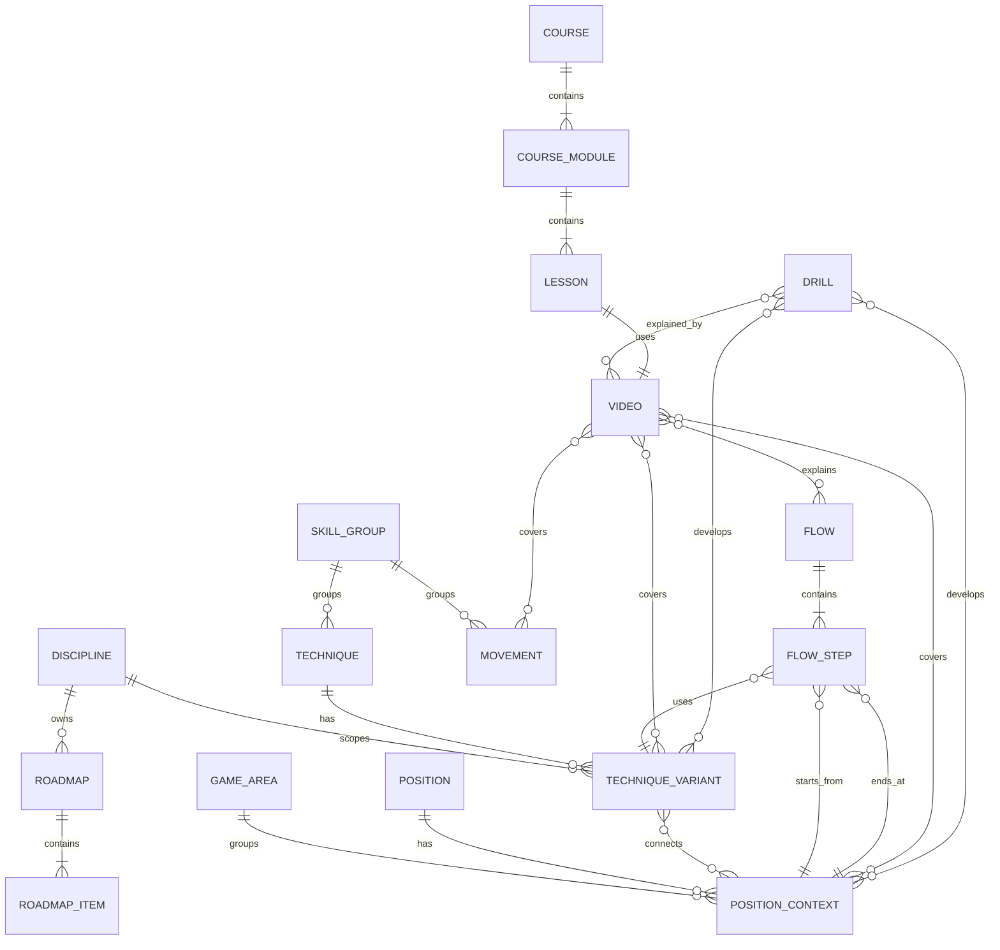

# Доменная модель MATIQ

## Назначение

Документ определяет согласованную терминологию и концептуальные связи MATIQ.
Это не схема базы данных и не Prisma Schema. Техническая модель создаётся
только после утверждения доменных границ.

## Основной словарь

| Термин | Значение |
|---|---|
| `Discipline` | Спортивная дисциплина, например BJJ Gi или No-Gi Grappling |
| `GameArea` | Общая область игры: `STANDING`, `TOP` или `BOTTOM` |
| `Position` | Спортивная позиция, например Side Control или Closed Guard |
| `PositionContext` | Работа из позиции с конкретной стороны, например Side Control `TOP` или `BOTTOM` |
| `SkillGroup` | Группа связанных навыков, например Takedowns, Guard Passing или Escapes |
| `Technique` | Спортивное действие, применяемое в реальной ситуации |
| `TechniqueVariant` | Вариант техники с учётом дисциплины, позиции и других условий |
| `Movement` | Базовое спортивное движение, например Shrimp, Bridge или Technical Stand-up |
| `Drill` | Повторяемый способ отработки позиции, техники или движения |
| `Flow` | Экспертно созданная последовательность переходов и техник |
| `Roadmap` | Персональный план развития конкретного спортсмена |
| `Video` | Основной воспроизводимый медиаматериал |
| `Course` | Упорядоченная образовательная программа |
| `Module` | Раздел курса |
| `Lesson` | Законченная тема курса с одним основным видео |

## Методологическая иерархия

```text
Discipline
└── GameArea
    ├── Position + PositionContext
    └── SkillGroup
        ├── Technique
        │   └── TechniqueVariant
        └── Movement
```

Пример:

```text
No-Gi Grappling
└── TOP
    ├── Takedowns
    │   ├── Single Leg
    │   │   ├── Outside Single Leg
    │   │   └── Run the Pipe
    │   └── Double Leg
    ├── Guard Passing
    │   ├── Knee Cut Pass
    │   └── Body Lock Pass
    └── Side Control / TOP
        ├── Control
        ├── Transitions
        └── Submissions
```

Иерархия используется для навигации и методологии, но не запрещает
дополнительные связи между сущностями.

## Дисциплины и варианты техник

Одна `Technique` может использоваться в нескольких дисциплинах. Отличия
исполнения хранятся в `TechniqueVariant`.

```text
Technique: Single Leg
├── Variant: BJJ Gi
└── Variant: No-Gi
```

Вариант может определять:

- дисциплину;
- начальную и конечную позиции;
- контекст `TOP`, `BOTTOM` или `STANDING`;
- допустимые захваты и ограничения;
- связанные материалы.

## Позиция и контекст

Одна позиция рассматривается с разных сторон:

```text
Side Control
├── TOP
│   ├── контроль
│   ├── улучшение позиции
│   └── атаки
└── BOTTOM
    ├── защита
    └── выходы
```

Оценки спортсмена для `TOP` и `BOTTOM` независимы. Сильная работа сверху не
означает сильную работу снизу в той же позиции.

## Оценка навыка

Оценка определяется по контексту:

```text
Discipline
+ GameArea
+ Position или SkillGroup
+ PositionContext
= SkillAssessment
```

Внутренняя шкала — от 1 до 5. Пользователю показываются понятные категории,
например:

| Значение | Категория |
|---|---|
| 1 | Очень слабая область |
| 2 | Требует развития |
| 3 | Средний уровень |
| 4 | Сильная область |
| 5 | Очень сильная область |

Точные названия немецких категорий утверждаются при проектировании интерфейса.
Значение формируется экспертными правилами, а не свободным решением AI.

## Техника и переходы

Техника может связывать позиции:

```text
Open Guard
    ↓ Knee Cut Pass
Side Control
```

Вариант техники может иметь:

- одну или несколько начальных позиций;
- одну или несколько конечных позиций;
- промежуточные состояния;
- основной контекст;
- дополнительные связанные позиции.

## Flow

`Flow` — экспертно подготовленная последовательность действий:

```text
Standing
    ↓ Takedown
Top Open Guard
    ↓ Guard Pass
Side Control
    ↓ Transition
Mount
```

Flow содержит:

- название;
- дисциплину;
- цель;
- упорядоченные шаги;
- начальную позицию шага;
- технику или вариант;
- конечную позицию шага.

Видео может объяснять весь Flow или отдельный шаг.

## Roadmap

`Roadmap` — персональный план развития спортсмена. Он отличается от Flow:

- Flow описывает экспертную последовательность действий;
- Roadmap описывает, что конкретному пользователю рекомендуется развивать;
- Roadmap может включать позиции, группы навыков, техники, варианты, дриллы,
  Flow, уроки и отдельные видео.

Для каждой выбранной дисциплины создаётся отдельный Roadmap. Пользователь может:

- добавлять существующие рекомендации;
- скрывать элементы;
- менять порядок;
- менять приоритет.

Пользователь не создаёт новые системные позиции, техники или варианты.

## Видео

Одно видео является законченным материалом, где объяснение и демонстрация не
разделяются.

Видео имеет:

- одну основную тему типа `GameArea`, `Position`, `SkillGroup`, `Technique`,
  `Movement` или `Drill`;
- основную дисциплину;
- связанные позиции и контексты;
- связанные группы навыков;
- связанные техники и варианты;
- связанные дриллы;
- связанные Flow;
- дополнительные темы.

Видео может показывать длинную последовательность, но основная тема определяет,
для какой рекомендации оно подходит в первую очередь.

Например, видео с основной темой `Takedowns` может дополнительно раскрывать
Single Leg, Double Leg и Body Lock Takedown.

## Movement

`Movement` описывает базовое движение, которое полезно само по себе и может
использоваться во многих техниках. В первую очередь оно необходимо для
материалов и рекомендаций новичкам.

Примеры:

- Shrimp;
- Bridge;
- Technical Stand-up.

Movement может быть связан с дисциплиной, позициями, техниками, дриллами и
видео.

## Курсы

```text
Course
└── Module
    └── Lesson
        └── Main Video
```

- Курс содержит упорядоченные модули.
- Модуль содержит упорядоченные уроки.
- Урок раскрывает одну законченную тему.
- Урок содержит одно основное видео.
- Дополнительные связанные видео показываются отдельно.
- Видео может существовать без курса и напрямую входить в Roadmap.

## Drill

`Drill` — отдельная сущность и метод развития позиции, техники или движения.
Он не является обязательным заданием.

Drill может содержать:

- тип выполнения `SOLO` или `PARTNER`;
- цель отработки;
- рекомендуемую длительность;
- рекомендуемое количество повторений;
- необходимое оборудование;
- связанные позиции и контексты;
- связанные техники и варианты;
- одно или несколько объясняющих видео.

Предварительные цели отработки:

- мышечная память;
- скорость;
- координация;
- реакция;
- качество движения;
- удержание или восстановление позиции.

## Концептуальные связи



Диаграмма отражает концепцию. Кардинальности уточняются при проектировании
физической схемы.

## Предварительные инварианты

- `DM-001`: `PositionContext` всегда относится к одной `Position`.
- `DM-002`: Оценки `TOP` и `BOTTOM` хранятся независимо.
- `DM-003`: `TechniqueVariant` всегда относится к одной основной `Technique`.
- `DM-004`: Каждый `FlowStep` имеет определённый порядок внутри Flow.
- `DM-005`: У видео есть ровно одна основная тема.
- `DM-006`: Урок содержит ровно одно основное видео.
- `DM-007`: Видео может существовать без курса.
- `DM-008`: Drill не является обязательным заданием пользователя.
- `DM-009`: Roadmap принадлежит одному пользователю и одной дисциплине.
- `DM-010`: Пользователь не создаёт системные методологические сущности.
- `DM-011`: Один Flow относится ровно к одной дисциплине.
- `DM-012`: Пользователь не видит старые Roadmap, но пересчёты сохраняются для
  технического аудита.
- `DM-013`: Методологические данные поддерживают локализацию; первая
  обязательная локаль — немецкая.
- `DM-014`: Основной темой видео может быть только `GameArea`, `Position`,
  `SkillGroup`, `Technique`, `Movement` или `Drill`.

## Открытые вопросы

- Как экспертные правила assessment связываются с оценками навыков?
- Как Roadmap хранит AI-объяснение и причины каждой рекомендации?
- Каков срок хранения технической истории Roadmap?

## Document status / Статус документа

- Статус: Утверждённая концептуальная основа
- Владелец: Команда MATIQ
- Последняя проверка: 2026-07-19
- Связанный код: Methodology, content, Roadmap; реализация ожидается
